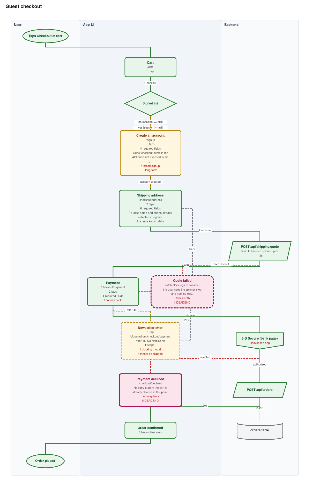
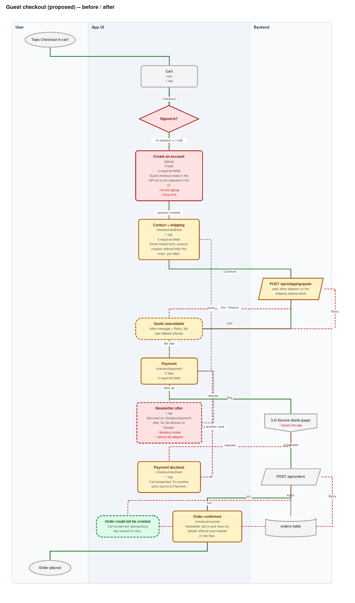

# uxflow

[](https://github.com/js-lover/uxflow/actions/workflows/uxflow.yml)
[](LICENSE)
[](https://www.python.org/)
[](#)

**Turn an existing app's code into editable UX flow diagrams — and a UX audit you can act on.**

Point an AI agent (or yourself) at a codebase. Get `.drawio` files you can open in
[diagrams.net](https://app.diagrams.net), Mermaid that renders inline on GitHub, SVG for your
README, and a findings report that names every dead end and unhandled failure with a
`file:line` you can jump to.

Zero dependencies. Python 3.8+ standard library only. MIT.

---

## Why it exists

Flow diagrams rot. Someone draws the checkout flow in Figma, ships three changes, and the
diagram is a lie by Friday. So nobody trusts it, so nobody updates it.

uxflow fixes that by splitting the problem in two:

```
   you / your agent                    uxflow (deterministic)
   ────────────────                    ──────────────────────
   read the code    ──►  flow.json  ──►  .drawio   .mmd   .svg   findings.md
                         (in git)         (regenerated, never hand-edited)
```

The JSON is the source of truth. It lives next to the code, reviews like code, and diffs like
code. The diagrams are build artefacts. A CI check fails the PR if they drift apart.

---

## What you get

| Output | For |
| --- | --- |
| `<flow>.annotated.drawio` | working sessions — friction, tap counts, required fields, error paths |
| `<flow>.clean.drawio` | stakeholders — the same structure without the annotations |
| `<flow>.mmd` | GitHub / GitLab Markdown, rendered inline |
| `<flow>.svg` | README embeds, PR previews |
| `<flow>.findings.md` | the audit: dead ends, unhandled errors, friction, funnel depth |

Both `.drawio` variants are fully editable — real shapes on a real canvas, not an embedded
image.

| annotated | clean | before/after diff |
| --- | --- | --- |
|  |  |  |

---

## Quick start

### With an AI agent (recommended)

Drop this repo into your project (or install it as a skill) and ask:

> Map the checkout and signup flows in this app and show me where the friction is.

The agent reads `SKILL.md` (Claude) or `AGENTS.md` (Cursor, Codex, Copilot, Cline, Aider,
Gemini…), inventories your routes, **asks you which flows to map**, traces them, writes the
IR, and runs the renderer.

### By hand

```bash
python3 scripts/uxflow.py init checkout -o docs/ux-flows
# edit docs/ux-flows/checkout.flow.json
python3 scripts/uxflow.py validate docs/ux-flows/checkout.flow.json
python3 scripts/uxflow.py render   docs/ux-flows/checkout.flow.json -o docs/ux-flows
```

### See it work right now

```bash
python3 scripts/uxflow.py render examples/checkout.flow.json -o /tmp/demo
python3 scripts/uxflow.py diff   examples/checkout.flow.json \
                                 examples/checkout-proposed.flow.json -o /tmp/demo
```

---

## Before / after — the point of the whole thing

Model the flow as it is. Copy it. Fix it. Render the delta:

```bash
python3 scripts/uxflow.py diff checkout.flow.json checkout-proposed.flow.json -o docs/ux-flows
```

From `examples/`, that produces:

| metric | before | after | delta |
| --- | ---: | ---: | ---: |
| steps on the primary path | 9 | 8 | −1 |
| taps on the primary path | 5 | 4 | −1 |
| required form fields | 14 | 9 | **−5** |
| modelled error branches | 2 | 6 | **+4** |
| friction tags | 9 | 1 | **−8** |
| high-severity findings | 7 | 0 | **−7** |

…followed by the individual findings the redesign **resolves** and any it **introduces**, each
by code and node id.

That table is a design argument you can take to a stakeholder. The colour-coded diff diagram
(added / removed / changed) is the picture that goes with it.

---

## Keeping diagrams honest in CI

Copy [`examples/ci/uxflow.yml`](examples/ci/uxflow.yml) into your app's
`.github/workflows/`. The two lines that matter:

```yaml
- run: python3 uxflow/scripts/uxflow.py check docs/ux-flows/*.flow.json -o docs/ux-flows
- run: python3 uxflow/scripts/uxflow.py audit docs/ux-flows/*.flow.json --fail-on-high
```

`check` compares each IR's content hash against `.uxflow.lock.json` and fails when someone
edited the flow without regenerating. `--fail-on-high` blocks merges that introduce a dead end
or a network call with no error branch.

---

## What the audit catches

Purely from the graph, no heuristics, no guessing:

- **unreachable** nodes — no path from any entry point
- **orphans** — nothing links here; reachable only by deep link or accident
- **dead ends** — the user arrives and the flow offers no way out
- **back-only screens** — the only exit is backwards
- **API calls with no error branch** — usually a real swallowed exception
- **single-branch decisions** — the alternative path is missing from the code or the model
- **funnel depth** over six steps
- every **friction tag** you recorded, severity-ranked, each with its `file:line`

Every finding points at a line of code. If it cannot, it is not reported.

---

## Supported stacks

Discovery playbooks ship for:

| Stack | Playbook |
| --- | --- |
| Next.js (App + Pages Router), React, React Router, Remix, TanStack Router | `references/discovery-web.md` |
| React Native, Expo (Expo Router + React Navigation) | `references/discovery-react-native.md` |
| Flutter (GoRouter, AutoRoute, named routes) | `references/discovery-flutter.md` |
| SwiftUI, UIKit, Jetpack Compose | `references/discovery-native.md` |

The IR itself is stack-agnostic — anything you can read, you can model.

---

## CLI

```
uxflow.py validate <flow.json>...                       schema + integrity check
uxflow.py render   <flow.json>... [-o DIR]              .drawio / .mmd / .svg / .md
                   [--variant both|annotated|clean]
                   [--formats drawio,mermaid,svg,md]
                   [--fail-on-high] [--no-audit]
uxflow.py audit    <flow.json>... [-o DIR]              findings only
uxflow.py diff     <before.json> <after.json> [-o DIR]  before/after + metric delta
uxflow.py check    <flow.json>... [-o DIR]              CI guard against stale diagrams
uxflow.py init     <flow-id> [-o DIR]                   scaffold an IR file
uxflow.py id       <route> [component]                  mint a stable node id
```

---

## Repository layout

```
SKILL.md                      Claude Code / Cowork entry point
AGENTS.md                     entry point for every other agent
schema/flow.schema.json       the IR contract
scripts/uxflow.py             CLI
scripts/uxflow_lib/           layout, renderers, audit, diff (stdlib only)
references/                   discovery playbooks + IR authoring guide
examples/                     a complete worked flow, its proposed redesign, and outputs
tests/test_uxflow.py          unittest suite, no dependencies
```

---

## Design decisions worth knowing

**Why not let draw.io auto-arrange?** Because the same IR must produce identical geometry
everywhere, or every regeneration is a 400-line diff. uxflow implements its own layered
(Sugiyama-style) layout: break cycles → layer → barycenter ordering → coordinates.

**Why stable node ids?** So `diff` can tell "this screen changed" from "this screen was
deleted and a different one added", and so regenerating a diagram touches only the lines that
actually changed.

**Why `source` anchors on every node?** Because a diagram nobody can verify is a diagram
nobody trusts. Hover a box in draw.io and you get `src/app/checkout/payment/page.tsx:24`.

**Why an intermediate JSON at all?** It decouples the part that needs judgement (reading code)
from the part that must be deterministic (drawing). It also means any agent — or a human, or a
script — can produce input, and the output is always the same.

---

## Installing

**As a Claude skill** — download `uxflow.skill` from
[Releases](https://github.com/js-lover/uxflow/releases) and open it.

**Vendored into your repo** (works with every agent, and without one):

```bash
git clone --depth 1 https://github.com/js-lover/uxflow.git
rm -rf uxflow/.git
```

Your agent picks it up from `AGENTS.md`; the CLI runs straight from `uxflow/scripts/uxflow.py`.

## Contributing

Adding a stack means adding one Markdown file to `references/`. The renderer does not change.
See [CONTRIBUTING.md](CONTRIBUTING.md).

```bash
python3 -m unittest discover -s tests -v
```

## Licence

MIT — see [LICENSE](LICENSE).
