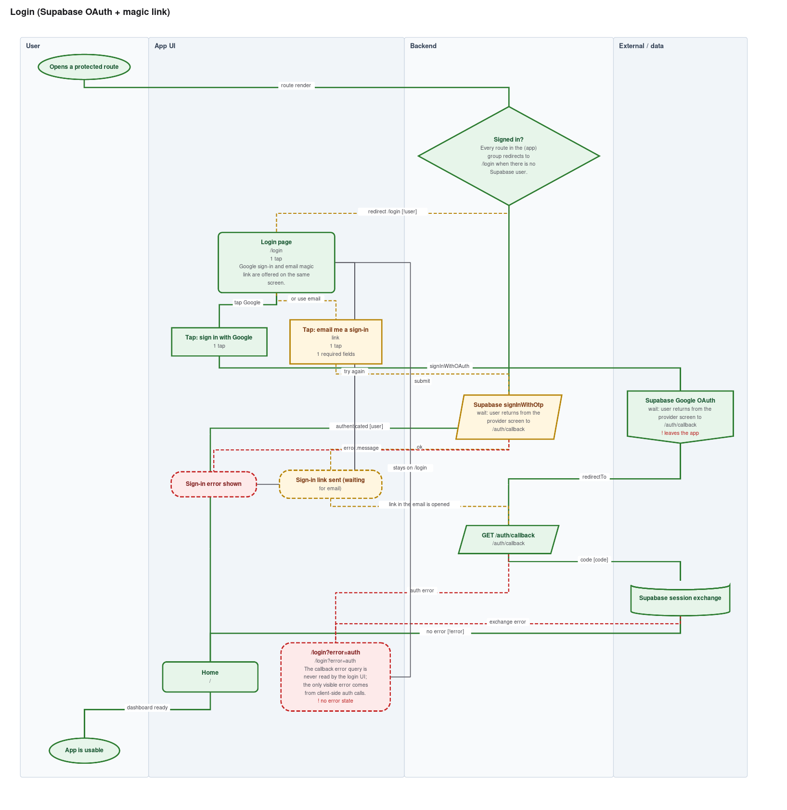

# flowlint

[](https://github.com/js-lover/flowlint/actions/workflows/flowlint.yml)
[](LICENSE)
[](https://www.python.org/)
[](#)

**A linter for your app's user flows.**

Your linter checks syntax. Your type checker checks types. Nothing checks whether a user
can get *out* of the screen they just landed on.

flowlint reads an existing codebase, maps the flow the code actually implements, and
reports what is wrong with it: dead ends, network calls with no error branch, OAuth
screens with no cancel path, forms that ask for what you already know. Every finding
names a `file:line`. Every diagram is editable in
[diagrams.net](https://app.diagrams.net) and renders inline on GitHub.

```bash
pip install flowlint
flowlint check docs/ux-flows/*.flow.json --fail-on-high
```

Zero dependencies. Python 3.8+ standard library only. MIT.

---

## Why it exists

Every application has two flows: the one the designer drew, and the one the code actually
implements. The second one is written down nowhere. Error states, empty states, cancel
paths, permission denials — these are rarely designed. They get improvised while coding,
or left out entirely.

flowlint extracts the second flow from the code itself. A real example from the login flow
of a real app, found in the first run:

> `/auth/callback` redirects to `/login?error=auth` when OAuth fails — but the login page
> never reads that query parameter. A user whose sign-in fails lands on an empty login
> screen with no message, taps the same button, and gets the same result.

Nobody designed that. It is what the code does. The value here is not a pretty diagram;
it is light on the branches nobody looked at.

### And it stays true

Flow diagrams rot. Someone draws the checkout flow in Figma, ships three changes, and the
diagram is a lie by Friday. So nobody trusts it, so nobody updates it.

flowlint avoids that by splitting the problem in two:

```
   you / your agent                    flowlint (deterministic)
   ────────────────                    ──────────────────────
   read the code    ──►  flow.json  ──►  <id>.drawio      <id>.md
                         (in git)         (regenerated, never hand-edited)
```

The JSON is the source of truth. It lives next to the code, reviews like code, and diffs like
code. The diagrams are build artefacts. A CI check fails the PR if they drift apart.

---

## What you get

Three files per flow. Not eight.

| Output | For |
| --- | --- |
| `<flow>.flow.json` | the IR — the only file you edit, reviewed like code |
| `<flow>.drawio` | multi-page: **Akış** (clean) · **Akış + notlar** (annotated) · **Değişim** (after a diff) |
| `<flow>.md` | the report: headline, priority list, diagram embedded as Mermaid, metrics, findings |

The `.drawio` is fully editable — real shapes on a real canvas, not an embedded image — and
draw.io shows each page as a tab, so the clean and annotated views live in one file instead
of drifting apart in two.

`--formats svg,mermaid` adds standalone files if you want them for README embeds.

## When not to use it

- **Not for greenfield design.** It reads existing code; it cannot draw a flow nobody wrote.
- **Not a visual review.** It cares about structure, not about the colour of the button.
- **It does not know what users actually do.** It extracts what the code *permits*, not what
  people choose. It complements analytics; it does not replace them.
- **Dynamic routing limits it.** If routes are assembled from strings at runtime, the map
  will be incomplete — and the report says so rather than guessing.

---

## What it looks like

| a real login flow | annotated view | before/after diff |
| --- | --- | --- |
|  |  |  |

The first is `examples/auth-login.flow.json` — a Supabase OAuth + magic-link sign-in, mapped
from a real Next.js app. Its report is `examples/output/auth-login.md`, and it is a good place
to see what the findings actually read like.

---

## Quick start

### With an AI agent (recommended)

Drop this repo into your project (or install it as a skill) and ask:

> Map the checkout and signup flows in this app and show me where the friction is.

The agent reads `SKILL.md` (Claude) or `AGENTS.md` (Cursor, Codex, Copilot, Cline, Aider,
Gemini…), inventories your routes, **asks you which flows to map**, traces them, writes the
IR, and runs the renderer.

### By hand

```bash
pip install flowlint

flowlint init checkout -o docs/ux-flows
# edit docs/ux-flows/checkout.flow.json
flowlint validate docs/ux-flows/checkout.flow.json
flowlint render   docs/ux-flows/checkout.flow.json -o docs/ux-flows
```

Without installing anything, substitute `python3 flowlint/scripts/flowlint.py` for `flowlint`.

### See it work right now

```bash
python3 scripts/flowlint.py render examples/checkout.flow.json -o /tmp/demo
python3 scripts/flowlint.py diff   examples/checkout.flow.json \
                                 examples/checkout-proposed.flow.json -o /tmp/demo
```

---

## Before / after — the point of the whole thing

Model the flow as it is. Copy it. Fix it. Render the delta:

```bash
python3 scripts/flowlint.py diff checkout.flow.json checkout-proposed.flow.json -o docs/ux-flows
```

From `examples/`, that produces:

| metric | before | after | delta |
| --- | ---: | ---: | ---: |
| steps on the primary path | 9 | 8 | −1 |
| taps on the primary path | 5 | 4 | −1 |
| required form fields | 14 | 9 | **−5** |
| modelled error branches | 2 | 6 | **+4** |
| friction tags | 9 | 1 | **−8** |
| high-severity findings | 7 | 0 | **−7** |

…followed by the individual findings the redesign **resolves** and any it **introduces**, each
by code and node id.

That table is a design argument you can take to a stakeholder. The colour-coded diff diagram
(added / removed / changed) is the picture that goes with it.

---

## Keeping diagrams honest in CI

Copy [`examples/ci/flowlint.yml`](examples/ci/flowlint.yml) into your app's
`.github/workflows/`. The two lines that matter:

```yaml
- run: python3 flowlint/scripts/flowlint.py stale docs/ux-flows/*.flow.json -o docs/ux-flows
- run: python3 flowlint/scripts/flowlint.py check docs/ux-flows/*.flow.json --fail-on-high
```

`stale` compares each IR's content hash against `.flowlint.lock.json` and fails when someone
edited the flow without regenerating. `--fail-on-high` blocks merges that introduce a dead end
or a network call with no error branch.

---

## What the audit catches

Purely from the graph, no heuristics, no guessing:

**Can the user get stuck?** — dead ends · back-only screens · unreachable nodes · orphans ·
redirect loops that contain no way to change the outcome

**What happens when it fails?** — API calls with no error branch · external hand-offs
(OAuth, 3-D Secure, payment) with no cancel path · error states with no recovery ·
out-of-band waits (magic link, OTP) with no resend · single-branch decisions

**Is it longer than it needs to be?** — funnel depth · taps · required fields · every
friction tag you recorded, severity-ranked

Plus model-quality checks: nodes with no `source` anchor are flagged, because a claim you
cannot verify weakens the whole map.

### Findings are written to be acted on

Not `no_error_state · "No error state."` A finding says what the code does, what the user
experiences, what to change, and where:

```markdown
### UXF-NOERR-0A7D · Hata kullanıcıya gösterilmiyor
**Önem:** yüksek · **Güven:** kesin · **Efor:** S (~1 saat)

**Ne oluyor** — /auth/callback hata durumunda /login?error=auth'a yönlendiriyor, ancak
login sayfası bu query parametresini hiç okumuyor.

**Kullanıcı ne yaşıyor** — Giriş dener, bir şey ters gider, kendini boş login ekranında
bulur. Hiçbir hata mesajı yok, aynı butona tekrar basar, aynı sonucu alır.

**Ne yapmalı** — useSearchParams() ile error parametresini oku ve mevcut hata bileşenine bas.

**Kanıt** — app/auth/callback/route.ts:17 · app/login/page.tsx:8 · app/login/page.tsx:104
```

Every finding has a stable id. Accept one and it stops failing CI without disappearing:

```bash
python3 scripts/flowlint.py ignore UXF-NOERR-0A7D --reason "Q3'te ele alınacak"
```

That is what makes `--fail-on-high` adoptable on a codebase that already exists.

---

## Supported stacks

Discovery playbooks ship for:

| Stack | Playbook |
| --- | --- |
| Next.js (App + Pages Router), React, React Router, Remix, TanStack Router | `references/discovery-web.md` |
| React Native, Expo (Expo Router + React Navigation) | `references/discovery-react-native.md` |
| Flutter (GoRouter, AutoRoute, named routes) | `references/discovery-flutter.md` |
| SwiftUI, UIKit, Jetpack Compose | `references/discovery-native.md` |

The IR itself is stack-agnostic — anything you can read, you can model.

---

## CLI

```
flowlint.py validate <flow.json>...                       schema + integrity check
flowlint.py render   <flow.json>... [-o DIR]              .drawio + report
                   [--formats drawio,md,svg,mermaid]    default: drawio,md
                   [--fail-on-high]
flowlint.py check    <flow.json>... [-o DIR]              report only
flowlint.py diff     <before.json> <after.json> [-o DIR]  before/after + metric delta
flowlint.py check    <flow.json>... [-o DIR]              CI guard against stale diagrams
flowlint.py ignore   <FINDING-ID>... [--reason TEXT]      accept a finding
flowlint.py init     <flow-id> [-o DIR]                   scaffold an IR file
flowlint.py id       <route> [component]                  mint a stable node id
```

---

## Repository layout

```
SKILL.md                      Claude Code / Cowork entry point
AGENTS.md                     entry point for every other agent
pyproject.toml                PyPI packaging (no dependencies)
schema/flow.schema.json       the IR contract
scripts/flowlint.py             thin shim for vendored use
scripts/flowlint_lib/           the package — ships to PyPI as `flowlint`
  cli.py                        argument parsing and commands
  analyze.py  catalog.py        audit rules and their prose
  benchmarks.py  report.py      metric verdicts and the Markdown report
  layout.py  drawio.py          geometry and renderers
  mermaid.py  svg.py  theme.py
  ir.py  diffing.py             the IR and before/after comparison
references/                   discovery playbooks, IR authoring, findings guide
examples/                     two worked flows, a proposed redesign, and outputs
tests/test_flowlint.py          64 tests, no dependencies
```

---

## Design decisions worth knowing

**Why not let draw.io auto-arrange?** Because the same IR must produce identical geometry
everywhere, or every regeneration is a 400-line diff. flowlint implements its own layered
(Sugiyama-style) layout: break cycles → layer → barycenter ordering → coordinates.

**Why stable node ids?** So `diff` can tell "this screen changed" from "this screen was
deleted and a different one added", and so regenerating a diagram touches only the lines that
actually changed.

**Why `source` anchors on every node?** Because a diagram nobody can verify is a diagram
nobody trusts. Hover a box in draw.io and you get `src/app/checkout/payment/page.tsx:24`.

**Why an intermediate JSON at all?** It decouples the part that needs judgement (reading code)
from the part that must be deterministic (drawing). It also means any agent — or a human, or a
script — can produce input, and the output is always the same.

**Why is the primary path computed with a DAG dynamic program?** Two earlier versions were
wrong in instructive ways. Following `happy` edges greedily meant a guard like *"already
signed in? → home"* ended the search after two hops, and every metric described a path no
real user walks. Enumerating simple paths under a visit budget was worse: a wide fan-out
exhausts the budget and returns a truncated answer *without saying so*. Removing
cycle-closing edges gives a DAG, where longest path is linear and exact. Silently wrong
metrics are the worst kind of bug in a tool people are supposed to trust.

---

## Installing

**As a CLI:**

```bash
pip install flowlint
flowlint init checkout -o docs/ux-flows
```

**As a skill in Claude Code** — a skill is just a directory with a `SKILL.md`, so
symlink the checkout and it stays current with every `git pull`:

```bash
git clone https://github.com/js-lover/flowlint.git ~/src/flowlint
mkdir -p ~/.claude/skills
ln -s ~/src/flowlint ~/.claude/skills/flowlint
```

Then `/flowlint` in any project, or just ask for a flow map and Claude loads it.
Use `.claude/skills/flowlint` instead of `~/.claude/skills/` to scope it to one repo.

**As a skill in Claude Cowork** — download `flowlint.skill` from
[Releases](https://github.com/js-lover/flowlint/releases) and open it.

**Vendored into your repo** (works with every agent, and without one):

```bash
git clone --depth 1 https://github.com/js-lover/flowlint.git
rm -rf flowlint/.git
```

Your agent picks it up from `AGENTS.md`; the CLI runs straight from
`flowlint/scripts/flowlint.py` with nothing installed.

All three run the same code. `pip install flowlint` pulls in no dependencies — standard
library only is a feature, because the tool has to work inside whatever environment an
agent happens to be in, with no resolver step.

## Contributing

Adding a stack means adding one Markdown file to `references/`. The renderer does not change.
See [CONTRIBUTING.md](CONTRIBUTING.md).

```bash
python3 -m unittest discover -s tests -v
```

## Licence

MIT — see [LICENSE](LICENSE).
