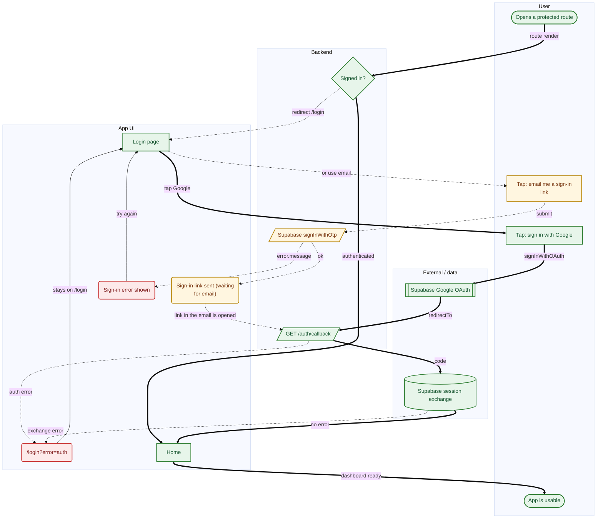

# Login (Supabase OAuth + magic link) — UX raporu

**Uygulama:** Example App · **Stack:** `nextjs` · **Commit:** `a31a654` · **Akış:** `auth-login`

> Reaching a protected route, signing in with Google OAuth or an emailed magic link, and returning through the auth callback.

## Özet

Bu akışta 4 bulgu var; 3 tanesi kullanıcıyı doğrudan etkileyen, 1 tanesi orta öncelikli. Ana yol 7 adım.

| | | |
| --- | ---: | --- |
| 🔴 **Yüksek öncelikli** | 3 | kullanıcıyı doğrudan etkiliyor |
| 🟠 Orta | 1 | dönüşüme mal oluyor |
| 🟡 Düşük | 0 | cilalama |
| | | |
| Ana yol | 7 adım | kullanıcının geçtiği nokta sayısı |
| Çıkmaz | 0 | kullanıcının takıldığı yol sayısı |

## Ne yapmalı

Önem, güven ve efor sırasına dizilmiş hâli. Yukarıdan aşağı çalışmak en hızlı iyileşmeyi verir; her madde doğrudan bir iş kaydına dönüştürülebilir.

| # | ne | nerede | efor | detay |
| ---: | --- | --- | --- | --- |
| 1 | 🔴 Hata kullanıcıya gösterilmiyor | /login?error=auth<br>`app/auth/callback/route.ts:17` | S | [UXF-NOERR-0A7D](#uxf-noerr-0a7d) |
| 2 | 🔴 Bant dışı bekleme, yeniden gönderim yok | Sign-in link sent (waiting for email)<br>`app/login/page.tsx:68` | S | [UXF-RESEND-A1AD](#uxf-resend-a1ad) |
| 3 | 🔴 Dış servisten iptal/hata dönüşü modellenmemiş | Supabase Google OAuth<br>`app/login/page.tsx:20` | M | [UXF-EXT-E61B](#uxf-ext-e61b) |
| 4 | 🟠 Ana yol gereğinden uzun | Login (Supabase OAuth + magic link)<br>— | L | [UXF-DEEP-2678](#uxf-deep-2678) |

## Akış



*Düzenlenebilir sürüm: `auth-login.drawio` — [diagrams.net](https://app.diagrams.net) ile aç. İkinci sekmede notlu görünüm var.*

## Ana yol

Kullanıcının hedefe ulaşmak için izlediği en uzun tam yolculuk — 7 adım:

- *başlangıç* — Opens a protected route
1. **Signed in?**
2. **Login page**  — 1 dokunuş
3. **Tap: sign in with Google**  — 1 dokunuş
4. **Supabase Google OAuth**  — bekleme
5. **GET /auth/callback**
6. **Supabase session exchange**
7. **Home**
- *hedef* — App is usable

## Ölçümler

| | ölçüm | değer | yorum |
| :-: | --- | ---: | --- |
| ! | Ana yol adım sayısı | 7 | 6 adımın üzerinde — her ek adım terk oranını artırır |
| ✓ | Ana yoldaki ekran sayısı | 2 | makul |
| ✓ | Ana yoldaki etkileşim | 2 | düşük etkileşim yükü |
| ✓ | Zorunlu form alanı (toplam) | 1 | az sayıda zorunlu alan |
| ✓ | Başarısızlıkla biten yol sayısı | 0 | kullanıcının kilitlendiği yol yok |
| ✓ | Hata dalı kapsamı | 100% | ağ çağrılarının tamamının hata dalı modellenmiş |
| ✓ | Kaynak çapası kapsamı | 100% | her düğüm koda kadar izlenebiliyor |

**Akış büyüklüğü:** 14 düğüm · 18 geçiş · 2 ekran · 2 ağ çağrısı · 1 karar noktası · 3 hata dalı

## Bulgular (4)

<a id="uxf-noerr-0a7d"></a>

### 🔴 Hata kullanıcıya gösterilmiyor

`UXF-NOERR-0A7D` · **düğüm:** /login?error=auth · **önem:** yüksek · **güven:** kesin · **efor:** S (~1 saat) · **route:** `/login?error=auth`

**Ne oluyor**

«/login?error=auth» için bir hata yolu var ama kullanıcı arayüzünde bu hatayı gösteren hiçbir şey yok.

**Kullanıcı ne yaşıyor**

Bir şey ters gittiğinde kullanıcı bunu öğrenemiyor. Boş ya da değişmemiş bir ekranla kalıyor, aynı işlemi tekrarlıyor, aynı sonucu alıyor. Sessiz terk edilmelerin en yaygın sebebi.

**Ne yapmalı**

Hata durumunu arayüze bağla. Yönlendirmeyle taşınan hatalarda (`?error=...`) hedef sayfanın bu parametreyi okuduğundan emin ol — bu adım sıklıkla atlanır.

**Kanıt:** `app/auth/callback/route.ts:17` · `app/login/page.tsx:8` · `app/login/page.tsx:104`

<sub>Kabul edip susturmak için: `flowlint ignore UXF-NOERR-0A7D`</sub>

<a id="uxf-resend-a1ad"></a>

### 🔴 Bant dışı bekleme, yeniden gönderim yok

`UXF-RESEND-A1AD` · **düğüm:** Sign-in link sent (waiting for email) · **önem:** yüksek · **güven:** güçlü ihtimal · **efor:** S (~1 saat)

**Ne oluyor**

«Sign-in link sent (waiting for email)» durumunda kullanıcı uygulama dışından gelecek bir şeyi (e-posta bağlantısı, SMS kodu) bekliyor, ama bu ekrandan yeniden gönderim ya da yöntem değiştirme yolu yok.

**Kullanıcı ne yaşıyor**

E-posta spam'e düştüyse ya da SMS gelmediyse kullanıcı tamamen kilitlenir. Elinde tek seçenek olarak baştan başlamak kalır — ki çoğu kişi bunu yapmaz, vazgeçer.

**Ne yapmalı**

«Tekrar gönder» ekle (bir bekleme süresiyle) ve alternatif yönteme geçiş sun. Ayrıca kullanıcıya nereye gönderildiğini göster ki yanlış adres girdiyse fark etsin.

**Kanıt:** `app/login/page.tsx:68`

<sub>Kabul edip susturmak için: `flowlint ignore UXF-RESEND-A1AD`</sub>

<a id="uxf-ext-e61b"></a>

### 🔴 Dış servisten iptal/hata dönüşü modellenmemiş

`UXF-EXT-E61B` · **düğüm:** Supabase Google OAuth · **önem:** yüksek · **güven:** güçlü ihtimal · **efor:** M (~yarım gün)

**Ne oluyor**

«Supabase Google OAuth» kullanıcıyı uygulamadan çıkarıyor, ama geri dönüşte yalnızca başarı yolu var. İptal ya da hata dönüşü için bir geçiş yok.

**Kullanıcı ne yaşıyor**

Kullanıcı dış ekranda (OAuth izni, 3-D Secure, ödeme sağlayıcısı) «İptal» derse ya da hata alırsa nereye düştüğü belirsiz. Genelde başlangıç ekranına hiçbir açıklama olmadan geri gelir ve neyin yanlış gittiğini bilemez.

**Ne yapmalı**

Sağlayıcının iptal/hata dönüş parametresini oku (`error`, `error_description`, `denied`) ve kullanıcıya ne olduğunu söyleyen bir duruma yönlendir. Dönüş adresini bu durumları taşıyacak şekilde tasarla.

**Kanıt:** `app/login/page.tsx:20`

<sub>Kabul edip susturmak için: `flowlint ignore UXF-EXT-E61B`</sub>

<a id="uxf-deep-2678"></a>

### 🟠 Ana yol gereğinden uzun

`UXF-DEEP-2678` · **düğüm:** Login (Supabase OAuth + magic link) · **önem:** orta · **güven:** kesin · **efor:** L (tasarım kararı gerekir)

**Ne oluyor**

Ana yol 7 adım (eşik 6).

**Kullanıcı ne yaşıyor**

Her ek adım kullanıcı kaybı üretir. Uzun akışlar özellikle mobilde ve ilk kullanımda belirgin şekilde daha düşük tamamlanma oranına sahiptir.

**Ne yapmalı**

Adımları birleştirmeyi dene: aynı ekranda toplanabilecek alanlar, sonraya ertelenebilecek kararlar, atlanabilecek onaylar.

<sub>Kabul edip susturmak için: `flowlint ignore UXF-DEEP-2678`</sub>

## Bilgi notları

Sorun değil, ama akışı okurken bilinmesi gerekenler.

- **Supabase Google OAuth** — Bu adımda kullanıcı uygulamadan çıkıp bir dış servise gidiyor. Kendi başına bir sorun değil, ama dönüş yollarının (iptal, hata) modellenmiş olması gerekir.  `app/login/page.tsx:20`

## Yöntem

Bu rapor `auth-login.flow.json` dosyasından üretildi; o dosya da kod tabanı okunarak çıkarıldı.

- **Kapsam:** 14 düğüm, 18 geçiş, `a31a654` commit'i
- **İzlenebilirlik:** düğümlerin %100'i bir `dosya:satır` çapası taşıyor
- **Bulgular yalnızca grafikten türetilir.** Uydurma yok: her bulgu ya grafiğin yapısından ya da koda dayanan bir etiketten gelir.
- **Bilinmeyen:** gerçek kullanıcı davranışı bu analizin dışındadır. Kodun izin verdiği yollar çıkarılır, insanların hangisini seçtiği değil. Analytics'in yerine geçmez, onunla birlikte okunur.

## Makine okuması için

<details><summary>Yapısal özet (JSON)</summary>

```json
{
  "flow": "auth-login",
  "title": "Login (Supabase OAuth + magic link)",
  "ir_hash": "d8a63d4318a30f23",
  "app": {
    "name": "Example App",
    "stack": "nextjs",
    "commit": "a31a654"
  },
  "metrics": {
    "nodes": 14,
    "edges": 18,
    "screens": 2,
    "api_calls": 2,
    "decisions": 1,
    "primary_path_steps": 7,
    "screens_on_primary_path": 2,
    "total_taps": 3,
    "taps_on_primary_path": 2,
    "required_fields": 1,
    "friction_tags": 1,
    "unreachable_nodes": 0,
    "error_branches": 3,
    "error_branch_coverage": 100,
    "source_coverage": 100,
    "failure_exits": 0
  },
  "primary_path": [
    "auth-start",
    "auth-guard",
    "login-screen",
    "google-oauth-action",
    "supabase-google-oauth",
    "auth-callback",
    "exchange-session",
    "app-home",
    "auth-end"
  ],
  "findings": [
    {
      "id": "UXF-NOERR-0A7D",
      "code": "friction:no_error_state",
      "severity": "high",
      "confidence": "certain",
      "effort": "S",
      "node": "callback-error-redirect",
      "label": "/login?error=auth",
      "evidence": [
        "app/auth/callback/route.ts:17",
        "app/login/page.tsx:8",
        "app/login/page.tsx:104"
      ],
      "fix": "Hata durumunu arayüze bağla. Yönlendirmeyle taşınan hatalarda (`?error=...`) hedef sayfanın bu parametreyi okuduğundan emin ol — bu adım sıklıkla atlanır."
    },
    {
      "id": "UXF-RESEND-A1AD",
      "code": "waiting_no_resend",
      "severity": "high",
      "confidence": "likely",
      "effort": "S",
      "node": "magic-link-sent",
      "label": "Sign-in link sent (waiting for email)",
      "evidence": [
        "app/login/page.tsx:68"
      ],
      "fix": "«Tekrar gönder» ekle (bir bekleme süresiyle) ve alternatif yönteme geçiş sun. Ayrıca kullanıcıya nereye gönderildiğini göster ki yanlış adres girdiyse fark etsin."
    },
    {
      "id": "UXF-EXT-E61B",
      "code": "external_no_return",
      "severity": "high",
      "confidence": "likely",
      "effort": "M",
      "node": "supabase-google-oauth",
      "label": "Supabase Google OAuth",
      "evidence": [
        "app/login/page.tsx:20"
      ],
      "fix": "Sağlayıcının iptal/hata dönüş parametresini oku (`error`, `error_description`, `denied`) ve kullanıcıya ne olduğunu söyleyen bir duruma yönlendir. Dönüş adresini bu durumları taşıyacak şekilde tasarla."
    },
    {
      "id": "UXF-DEEP-2678",
      "code": "flow_too_deep",
      "severity": "medium",
      "confidence": "certain",
      "effort": "L",
      "node": "",
      "label": "Login (Supabase OAuth + magic link)",
      "evidence": [],
      "fix": "Adımları birleştirmeyi dene: aynı ekranda toplanabilecek alanlar, sonraya ertelenebilecek kararlar, atlanabilecek onaylar."
    }
  ],
  "suppressed": []
}
```

</details>
