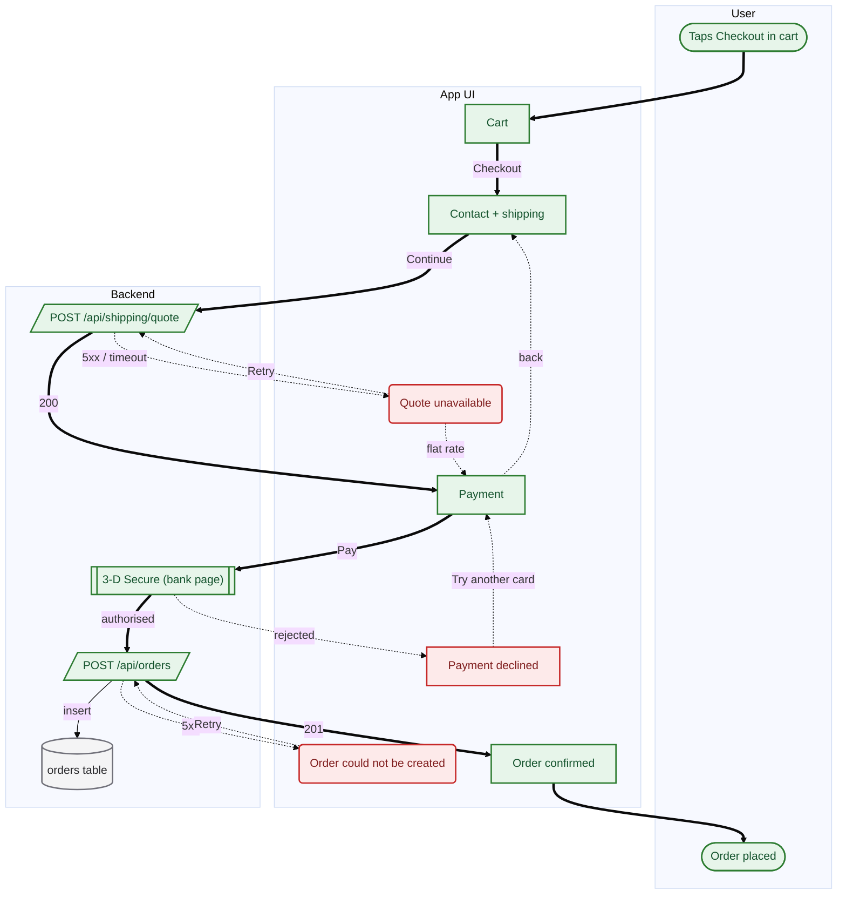

# Guest checkout (proposed) — UX raporu

**Uygulama:** Example Shop · **Stack:** `nextjs` · **Commit:** `proposal` · **Akış:** `checkout-proposed`

> Same goal, with the forced signup removed, the failure branches modelled, and the promo interstitial moved off the critical path.

## Özet

Bu akışta 12 bulgu var; 1 tanesi orta öncelikli. Ana yol 7 adım.

| | | |
| --- | ---: | --- |
| 🔴 **Yüksek öncelikli** | 0 | kullanıcıyı doğrudan etkiliyor |
| 🟠 Orta | 1 | dönüşüme mal oluyor |
| 🟡 Düşük | 11 | cilalama |
| | | |
| Ana yol | 7 adım | kullanıcının geçtiği nokta sayısı |
| Çıkmaz | 0 | kullanıcının takıldığı yol sayısı |

## Ne yapmalı

Önem, güven ve efor sırasına dizilmiş hâli. Yukarıdan aşağı çalışmak en hızlı iyileşmeyi verir; her madde doğrudan bir iş kaydına dönüştürülebilir.

| # | ne | nerede | efor | detay |
| ---: | --- | --- | --- | --- |
| 1 | 🟠 Ana yol gereğinden uzun | Guest checkout (proposed)<br>— | L | [UXF-DEEP-2678](#uxf-deep-2678) |
| 2 | 🟡 Kaynak çapası olmayan düğüm | Contact + shipping<br>— | S | [UXF-SRC-87CF](#uxf-src-87cf) |
| 3 | 🟡 Kaynak çapası olmayan düğüm | Cart<br>— | S | [UXF-SRC-397E](#uxf-src-397e) |
| 4 | 🟡 Kaynak çapası olmayan düğüm | POST /api/orders<br>— | S | [UXF-SRC-D2BF](#uxf-src-d2bf) |
| 5 | 🟡 Kaynak çapası olmayan düğüm | Order could not be created<br>— | S | [UXF-SRC-DE37](#uxf-src-de37) |
| 6 | 🟡 Kaynak çapası olmayan düğüm | Order confirmed<br>— | S | [UXF-SRC-D3E9](#uxf-src-d3e9) |
| 7 | 🟡 Kaynak çapası olmayan düğüm | Payment declined<br>— | S | [UXF-SRC-0623](#uxf-src-0623) |
| 8 | 🟡 Kaynak çapası olmayan düğüm | orders table<br>— | S | [UXF-SRC-4989](#uxf-src-4989) |
| 9 | 🟡 Kaynak çapası olmayan düğüm | Payment<br>— | S | [UXF-SRC-110F](#uxf-src-110f) |
| 10 | 🟡 Kaynak çapası olmayan düğüm | 3-D Secure (bank page)<br>— | S | [UXF-SRC-ABCA](#uxf-src-abca) |
| 11 | 🟡 Kaynak çapası olmayan düğüm | POST /api/shipping/quote<br>— | S | [UXF-SRC-A57E](#uxf-src-a57e) |
| 12 | 🟡 Kaynak çapası olmayan düğüm | Quote unavailable<br>— | S | [UXF-SRC-CEB0](#uxf-src-ceb0) |

## Akış



*Düzenlenebilir sürüm: `checkout-proposed.drawio` — [diagrams.net](https://app.diagrams.net) ile aç. İkinci sekmede notlu görünüm var.*

## Ana yol

Kullanıcının hedefe ulaşmak için izlediği en uzun tam yolculuk — 7 adım:

- *başlangıç* — Taps Checkout in cart
1. **Cart**  — 1 dokunuş
2. **Contact + shipping**  — 1 dokunuş, 5 zorunlu alan
3. **POST /api/shipping/quote**  — bekleme
4. **Payment**  — 2 dokunuş, 4 zorunlu alan
5. **3-D Secure (bank page)**
6. **POST /api/orders**
7. **Order confirmed**
- *hedef* — Order placed

## Ölçümler

| | ölçüm | değer | yorum |
| :-: | --- | ---: | --- |
| ! | Ana yol adım sayısı | 7 | 6 adımın üzerinde — her ek adım terk oranını artırır |
| ✓ | Ana yoldaki ekran sayısı | 4 | makul |
| ✓ | Ana yoldaki etkileşim | 4 | düşük etkileşim yükü |
| ! | Zorunlu form alanı (toplam) | 9 | her zorunlu alan bir vazgeçme fırsatı — hepsi gerçekten zorunlu mu? |
| ✓ | Başarısızlıkla biten yol sayısı | 0 | kullanıcının kilitlendiği yol yok |
| ✓ | Hata dalı kapsamı | 100% | ağ çağrılarının tamamının hata dalı modellenmiş |
| ✗ | Kaynak çapası kapsamı | 0% | düğümlerin önemli bir kısmı koda dayanmıyor — haritaya temkinli yaklaş |

**Akış büyüklüğü:** 13 düğüm · 17 geçiş · 5 ekran · 2 ağ çağrısı · 0 karar noktası · 6 hata dalı

## Bulgular (12)

<a id="uxf-deep-2678"></a>

### 🟠 Ana yol gereğinden uzun

`UXF-DEEP-2678` · **düğüm:** Guest checkout (proposed) · **önem:** orta · **güven:** kesin · **efor:** L (tasarım kararı gerekir)

**Ne oluyor**

Ana yol 7 adım (eşik 6).

**Kullanıcı ne yaşıyor**

Her ek adım kullanıcı kaybı üretir. Uzun akışlar özellikle mobilde ve ilk kullanımda belirgin şekilde daha düşük tamamlanma oranına sahiptir.

**Ne yapmalı**

Adımları birleştirmeyi dene: aynı ekranda toplanabilecek alanlar, sonraya ertelenebilecek kararlar, atlanabilecek onaylar.

<sub>Kabul edip susturmak için: `uxflow ignore UXF-DEEP-2678`</sub>

<a id="uxf-src-87cf"></a>

### 🟡 Kaynak çapası olmayan düğüm

`UXF-SRC-87CF` · **düğüm:** Contact + shipping · **önem:** düşük · **güven:** kesin · **efor:** S (~1 saat) · **route:** `/checkout/address`

**Ne oluyor**

«Contact + shipping» düğümünde `source` alanı yok.

**Kullanıcı ne yaşıyor**

Bu düğümün koda dayandığı doğrulanamıyor. Haritanın geri kalanına duyulan güveni de zayıflatır.

**Ne yapmalı**

Düğümün geldiği `dosya:satır` bilgisini ekle. Koda dayanmıyorsa (varsayım, gelecek plan) IR'dan çıkar ya da `note` ile açıkça belirt.

<sub>Kabul edip susturmak için: `uxflow ignore UXF-SRC-87CF`</sub>

<a id="uxf-src-397e"></a>

### 🟡 Kaynak çapası olmayan düğüm

`UXF-SRC-397E` · **düğüm:** Cart · **önem:** düşük · **güven:** kesin · **efor:** S (~1 saat) · **route:** `/cart`

**Ne oluyor**

«Cart» düğümünde `source` alanı yok.

**Kullanıcı ne yaşıyor**

Bu düğümün koda dayandığı doğrulanamıyor. Haritanın geri kalanına duyulan güveni de zayıflatır.

**Ne yapmalı**

Düğümün geldiği `dosya:satır` bilgisini ekle. Koda dayanmıyorsa (varsayım, gelecek plan) IR'dan çıkar ya da `note` ile açıkça belirt.

<sub>Kabul edip susturmak için: `uxflow ignore UXF-SRC-397E`</sub>

<a id="uxf-src-d2bf"></a>

### 🟡 Kaynak çapası olmayan düğüm

`UXF-SRC-D2BF` · **düğüm:** POST /api/orders · **önem:** düşük · **güven:** kesin · **efor:** S (~1 saat)

**Ne oluyor**

«POST /api/orders» düğümünde `source` alanı yok.

**Kullanıcı ne yaşıyor**

Bu düğümün koda dayandığı doğrulanamıyor. Haritanın geri kalanına duyulan güveni de zayıflatır.

**Ne yapmalı**

Düğümün geldiği `dosya:satır` bilgisini ekle. Koda dayanmıyorsa (varsayım, gelecek plan) IR'dan çıkar ya da `note` ile açıkça belirt.

<sub>Kabul edip susturmak için: `uxflow ignore UXF-SRC-D2BF`</sub>

<a id="uxf-src-de37"></a>

### 🟡 Kaynak çapası olmayan düğüm

`UXF-SRC-DE37` · **düğüm:** Order could not be created · **önem:** düşük · **güven:** kesin · **efor:** S (~1 saat)

**Ne oluyor**

«Order could not be created» düğümünde `source` alanı yok.

**Kullanıcı ne yaşıyor**

Bu düğümün koda dayandığı doğrulanamıyor. Haritanın geri kalanına duyulan güveni de zayıflatır.

**Ne yapmalı**

Düğümün geldiği `dosya:satır` bilgisini ekle. Koda dayanmıyorsa (varsayım, gelecek plan) IR'dan çıkar ya da `note` ile açıkça belirt.

<sub>Kabul edip susturmak için: `uxflow ignore UXF-SRC-DE37`</sub>

<a id="uxf-src-d3e9"></a>

### 🟡 Kaynak çapası olmayan düğüm

`UXF-SRC-D3E9` · **düğüm:** Order confirmed · **önem:** düşük · **güven:** kesin · **efor:** S (~1 saat) · **route:** `/checkout/success`

**Ne oluyor**

«Order confirmed» düğümünde `source` alanı yok.

**Kullanıcı ne yaşıyor**

Bu düğümün koda dayandığı doğrulanamıyor. Haritanın geri kalanına duyulan güveni de zayıflatır.

**Ne yapmalı**

Düğümün geldiği `dosya:satır` bilgisini ekle. Koda dayanmıyorsa (varsayım, gelecek plan) IR'dan çıkar ya da `note` ile açıkça belirt.

<sub>Kabul edip susturmak için: `uxflow ignore UXF-SRC-D3E9`</sub>

<a id="uxf-src-0623"></a>

### 🟡 Kaynak çapası olmayan düğüm

`UXF-SRC-0623` · **düğüm:** Payment declined · **önem:** düşük · **güven:** kesin · **efor:** S (~1 saat) · **route:** `/checkout/declined`

**Ne oluyor**

«Payment declined» düğümünde `source` alanı yok.

**Kullanıcı ne yaşıyor**

Bu düğümün koda dayandığı doğrulanamıyor. Haritanın geri kalanına duyulan güveni de zayıflatır.

**Ne yapmalı**

Düğümün geldiği `dosya:satır` bilgisini ekle. Koda dayanmıyorsa (varsayım, gelecek plan) IR'dan çıkar ya da `note` ile açıkça belirt.

<sub>Kabul edip susturmak için: `uxflow ignore UXF-SRC-0623`</sub>

<a id="uxf-src-4989"></a>

### 🟡 Kaynak çapası olmayan düğüm

`UXF-SRC-4989` · **düğüm:** orders table · **önem:** düşük · **güven:** kesin · **efor:** S (~1 saat)

**Ne oluyor**

«orders table» düğümünde `source` alanı yok.

**Kullanıcı ne yaşıyor**

Bu düğümün koda dayandığı doğrulanamıyor. Haritanın geri kalanına duyulan güveni de zayıflatır.

**Ne yapmalı**

Düğümün geldiği `dosya:satır` bilgisini ekle. Koda dayanmıyorsa (varsayım, gelecek plan) IR'dan çıkar ya da `note` ile açıkça belirt.

<sub>Kabul edip susturmak için: `uxflow ignore UXF-SRC-4989`</sub>

<a id="uxf-src-110f"></a>

### 🟡 Kaynak çapası olmayan düğüm

`UXF-SRC-110F` · **düğüm:** Payment · **önem:** düşük · **güven:** kesin · **efor:** S (~1 saat) · **route:** `/checkout/payment`

**Ne oluyor**

«Payment» düğümünde `source` alanı yok.

**Kullanıcı ne yaşıyor**

Bu düğümün koda dayandığı doğrulanamıyor. Haritanın geri kalanına duyulan güveni de zayıflatır.

**Ne yapmalı**

Düğümün geldiği `dosya:satır` bilgisini ekle. Koda dayanmıyorsa (varsayım, gelecek plan) IR'dan çıkar ya da `note` ile açıkça belirt.

<sub>Kabul edip susturmak için: `uxflow ignore UXF-SRC-110F`</sub>

<a id="uxf-src-abca"></a>

### 🟡 Kaynak çapası olmayan düğüm

`UXF-SRC-ABCA` · **düğüm:** 3-D Secure (bank page) · **önem:** düşük · **güven:** kesin · **efor:** S (~1 saat)

**Ne oluyor**

«3-D Secure (bank page)» düğümünde `source` alanı yok.

**Kullanıcı ne yaşıyor**

Bu düğümün koda dayandığı doğrulanamıyor. Haritanın geri kalanına duyulan güveni de zayıflatır.

**Ne yapmalı**

Düğümün geldiği `dosya:satır` bilgisini ekle. Koda dayanmıyorsa (varsayım, gelecek plan) IR'dan çıkar ya da `note` ile açıkça belirt.

<sub>Kabul edip susturmak için: `uxflow ignore UXF-SRC-ABCA`</sub>

<a id="uxf-src-a57e"></a>

### 🟡 Kaynak çapası olmayan düğüm

`UXF-SRC-A57E` · **düğüm:** POST /api/shipping/quote · **önem:** düşük · **güven:** kesin · **efor:** S (~1 saat)

**Ne oluyor**

«POST /api/shipping/quote» düğümünde `source` alanı yok.

**Kullanıcı ne yaşıyor**

Bu düğümün koda dayandığı doğrulanamıyor. Haritanın geri kalanına duyulan güveni de zayıflatır.

**Ne yapmalı**

Düğümün geldiği `dosya:satır` bilgisini ekle. Koda dayanmıyorsa (varsayım, gelecek plan) IR'dan çıkar ya da `note` ile açıkça belirt.

<sub>Kabul edip susturmak için: `uxflow ignore UXF-SRC-A57E`</sub>

<a id="uxf-src-ceb0"></a>

### 🟡 Kaynak çapası olmayan düğüm

`UXF-SRC-CEB0` · **düğüm:** Quote unavailable · **önem:** düşük · **güven:** kesin · **efor:** S (~1 saat)

**Ne oluyor**

«Quote unavailable» düğümünde `source` alanı yok.

**Kullanıcı ne yaşıyor**

Bu düğümün koda dayandığı doğrulanamıyor. Haritanın geri kalanına duyulan güveni de zayıflatır.

**Ne yapmalı**

Düğümün geldiği `dosya:satır` bilgisini ekle. Koda dayanmıyorsa (varsayım, gelecek plan) IR'dan çıkar ya da `note` ile açıkça belirt.

<sub>Kabul edip susturmak için: `uxflow ignore UXF-SRC-CEB0`</sub>

## Bilgi notları

Sorun değil, ama akışı okurken bilinmesi gerekenler.

- **3-D Secure (bank page)** — Bu adımda kullanıcı uygulamadan çıkıp bir dış servise gidiyor. Kendi başına bir sorun değil, ama dönüş yollarının (iptal, hata) modellenmiş olması gerekir.

## Yöntem

Bu rapor `checkout-proposed.flow.json` dosyasından üretildi; o dosya da kod tabanı okunarak çıkarıldı.

- **Kapsam:** 13 düğüm, 17 geçiş, `proposal` commit'i
- **İzlenebilirlik:** düğümlerin %0'i bir `dosya:satır` çapası taşıyor
- **Bulgular yalnızca grafikten türetilir.** Uydurma yok: her bulgu ya grafiğin yapısından ya da koda dayanan bir etiketten gelir.
- **Bilinmeyen:** gerçek kullanıcı davranışı bu analizin dışındadır. Kodun izin verdiği yollar çıkarılır, insanların hangisini seçtiği değil. Analytics'in yerine geçmez, onunla birlikte okunur.
- **Dikkat:** bazı düğümler koda kadar izlenemiyor; bu bölümlere temkinli yaklaş.

## Makine okuması için

<details><summary>Yapısal özet (JSON)</summary>

```json
{
  "flow": "checkout-proposed",
  "title": "Guest checkout (proposed)",
  "ir_hash": "b87d703e6164b5fc",
  "app": {
    "name": "Example Shop",
    "stack": "nextjs",
    "commit": "proposal"
  },
  "metrics": {
    "nodes": 13,
    "edges": 17,
    "screens": 5,
    "api_calls": 2,
    "decisions": 0,
    "primary_path_steps": 7,
    "screens_on_primary_path": 4,
    "total_taps": 5,
    "taps_on_primary_path": 4,
    "required_fields": 9,
    "friction_tags": 0,
    "unreachable_nodes": 0,
    "error_branches": 6,
    "error_branch_coverage": 100,
    "source_coverage": 0,
    "failure_exits": 0
  },
  "primary_path": [
    "start",
    "cart",
    "address",
    "shipping-api",
    "payment",
    "psp",
    "charge",
    "confirm",
    "done"
  ],
  "findings": [
    {
      "id": "UXF-DEEP-2678",
      "code": "flow_too_deep",
      "severity": "medium",
      "confidence": "certain",
      "effort": "L",
      "node": "",
      "label": "Guest checkout (proposed)",
      "evidence": [],
      "fix": "Adımları birleştirmeyi dene: aynı ekranda toplanabilecek alanlar, sonraya ertelenebilecek kararlar, atlanabilecek onaylar."
    },
    {
      "id": "UXF-SRC-87CF",
      "code": "missing_source",
      "severity": "low",
      "confidence": "certain",
      "effort": "S",
      "node": "address",
      "label": "Contact + shipping",
      "evidence": [],
      "fix": "Düğümün geldiği `dosya:satır` bilgisini ekle. Koda dayanmıyorsa (varsayım, gelecek plan) IR'dan çıkar ya da `note` ile açıkça belirt."
    },
    {
      "id": "UXF-SRC-397E",
      "code": "missing_source",
      "severity": "low",
      "confidence": "certain",
      "effort": "S",
      "node": "cart",
      "label": "Cart",
      "evidence": [],
      "fix": "Düğümün geldiği `dosya:satır` bilgisini ekle. Koda dayanmıyorsa (varsayım, gelecek plan) IR'dan çıkar ya da `note` ile açıkça belirt."
    },
    {
      "id": "UXF-SRC-D2BF",
      "code": "missing_source",
      "severity": "low",
      "confidence": "certain",
      "effort": "S",
      "node": "charge",
      "label": "POST /api/orders",
      "evidence": [],
      "fix": "Düğümün geldiği `dosya:satır` bilgisini ekle. Koda dayanmıyorsa (varsayım, gelecek plan) IR'dan çıkar ya da `note` ile açıkça belirt."
    },
    {
      "id": "UXF-SRC-DE37",
      "code": "missing_source",
      "severity": "low",
      "confidence": "certain",
      "effort": "S",
      "node": "charge-error",
      "label": "Order could not be created",
      "evidence": [],
      "fix": "Düğümün geldiği `dosya:satır` bilgisini ekle. Koda dayanmıyorsa (varsayım, gelecek plan) IR'dan çıkar ya da `note` ile açıkça belirt."
    },
    {
      "id": "UXF-SRC-D3E9",
      "code": "missing_source",
      "severity": "low",
      "confidence": "certain",
      "effort": "S",
      "node": "confirm",
      "label": "Order confirmed",
      "evidence": [],
      "fix": "Düğümün geldiği `dosya:satır` bilgisini ekle. Koda dayanmıyorsa (varsayım, gelecek plan) IR'dan çıkar ya da `note` ile açıkça belirt."
    },
    {
      "id": "UXF-SRC-0623",
      "code": "missing_source",
      "severity": "low",
      "confidence": "certain",
      "effort": "S",
      "node": "declined",
      "label": "Payment declined",
      "evidence": [],
      "fix": "Düğümün geldiği `dosya:satır` bilgisini ekle. Koda dayanmıyorsa (varsayım, gelecek plan) IR'dan çıkar ya da `note` ile açıkça belirt."
    },
    {
      "id": "UXF-SRC-4989",
      "code": "missing_source",
      "severity": "low",
      "confidence": "certain",
      "effort": "S",
      "node": "orders-db",
      "label": "orders table",
      "evidence": [],
      "fix": "Düğümün geldiği `dosya:satır` bilgisini ekle. Koda dayanmıyorsa (varsayım, gelecek plan) IR'dan çıkar ya da `note` ile açıkça belirt."
    },
    {
      "id": "UXF-SRC-110F",
      "code": "missing_source",
      "severity": "low",
      "confidence": "certain",
      "effort": "S",
      "node": "payment",
      "label": "Payment",
      "evidence": [],
      "fix": "Düğümün geldiği `dosya:satır` bilgisini ekle. Koda dayanmıyorsa (varsayım, gelecek plan) IR'dan çıkar ya da `note` ile açıkça belirt."
    },
    {
      "id": "UXF-SRC-ABCA",
      "code": "missing_source",
      "severity": "low",
      "confidence": "certain",
      "effort": "S",
      "node": "psp",
      "label": "3-D Secure (bank page)",
      "evidence": [],
      "fix": "Düğümün geldiği `dosya:satır` bilgisini ekle. Koda dayanmıyorsa (varsayım, gelecek plan) IR'dan çıkar ya da `note` ile açıkça belirt."
    },
    {
      "id": "UXF-SRC-A57E",
      "code": "missing_source",
      "severity": "low",
      "confidence": "certain",
      "effort": "S",
      "node": "shipping-api",
      "label": "POST /api/shipping/quote",
      "evidence": [],
      "fix": "Düğümün geldiği `dosya:satır` bilgisini ekle. Koda dayanmıyorsa (varsayım, gelecek plan) IR'dan çıkar ya da `note` ile açıkça belirt."
    },
    {
      "id": "UXF-SRC-CEB0",
      "code": "missing_source",
      "severity": "low",
      "confidence": "certain",
      "effort": "S",
      "node": "shipping-error",
      "label": "Quote unavailable",
      "evidence": [],
      "fix": "Düğümün geldiği `dosya:satır` bilgisini ekle. Koda dayanmıyorsa (varsayım, gelecek plan) IR'dan çıkar ya da `note` ile açıkça belirt."
    }
  ],
  "suppressed": []
}
```

</details>

# Flow diff -- Guest checkout (proposed)

`checkout` (before, hash ac3604074e5deec3) → `checkout-proposed` (after, hash b87d703e6164b5fc)

## What changed

| | count |
| --- | ---: |
| Nodes added | 1 |
| Nodes removed | 3 |
| Nodes changed | 6 |
| Nodes unchanged | 6 |

## Metric delta

| metric | before | after | delta |
| --- | ---: | ---: | ---: |
| primary path steps | 8 | 7 | -1 |
| screens on primary path | 4 | 4 | ±0 |
| taps on primary path | 5 | 4 | -1 |
| required fields | 14 | 9 | -5 |
| screens | 7 | 5 | -2 |
| api calls | 2 | 2 | ±0 |
| error branches | 2 | 6 | +4 |
| friction tags | 8 | 0 | -8 |
| high-severity findings | 7 | 0 | -7 |
| medium-severity findings | 5 | 1 | -4 |
| low-severity findings | 0 | 11 | +11 |

## Findings resolved

- `deadend` on `declined`
- `deadend` on `shipping-error`
- `friction:blocking_modal` on `promo-modal`
- `friction:duplicate_input` on `address`
- `friction:forced_signup` on `signup`
- `friction:long_form` on `signup`
- `friction:no_back_affordance` on `declined`
- `friction:no_back_affordance` on `payment`
- `friction:silent_failure` on `shipping-error`
- `friction:unskippable` on `promo-modal`
- `no_error_branch` on `charge`

## Findings introduced

- `missing_source` on `address`
- `missing_source` on `cart`
- `missing_source` on `charge`
- `missing_source` on `charge-error`
- `missing_source` on `confirm`
- `missing_source` on `declined`
- `missing_source` on `orders-db`
- `missing_source` on `payment`
- `missing_source` on `psp`
- `missing_source` on `shipping-api`
- `missing_source` on `shipping-error`

## Added

- **Order could not be created** (`charge-error`)

## Removed

- **Signed in?** (`auth-gate`)
- **Create an account** (`signup`)
- **Newsletter offer** (`promo-modal`)

## Changed

- **Contact + shipping** (`address`) — label, annotations
  - `label`: 'Shipping address' → 'Contact + shipping'
- **POST /api/shipping/quote** (`shipping-api`) — annotations
- **Quote unavailable** (`shipping-error`) — label, annotations
  - `label`: 'Quote failed' → 'Quote unavailable'
- **Payment** (`payment`) — annotations
- **Payment declined** (`declined`) — annotations
- **Order confirmed** (`confirm`) — annotations

