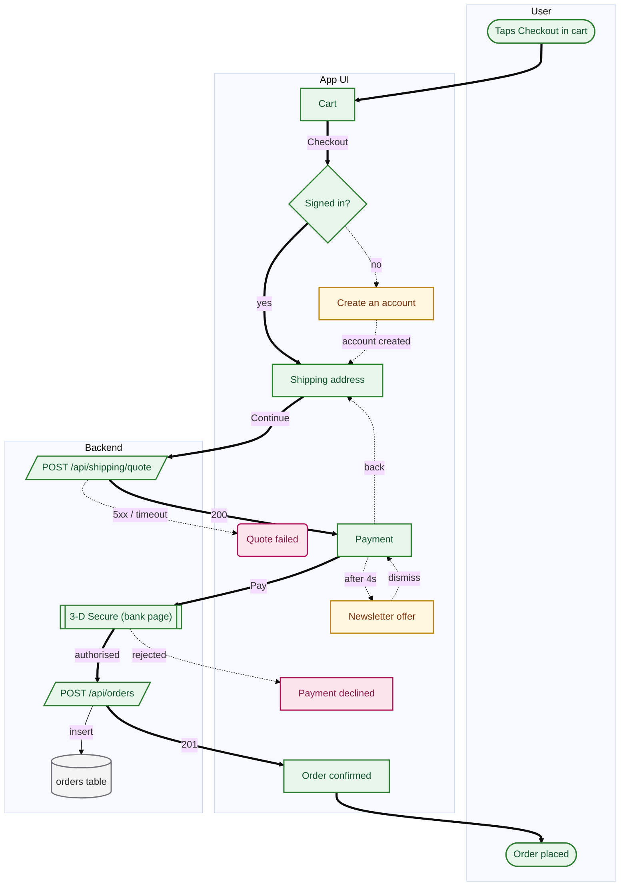

# Guest checkout — flow report

**App:** Example Shop · **Stack:** `nextjs` · **Commit:** `a1b2c3d` · **Flow:** `checkout`

> From cart to order confirmation for a user who is not signed in.

## Summary

This flow has 12 findings: 7 that affect users directly, 5 of medium priority. There are 2 distinct ways to end up stuck short of the goal. The primary path is 8 steps.

| | | |
| --- | ---: | --- |
| 🔴 **High** | 7 | affects users directly |
| 🟠 Medium | 5 | costs conversion |
| 🟡 Low | 0 | polish |
| | | |
| Primary path | 8 steps | places the user passes through |
| Stuck | 2 | ways to end up going nowhere |

## What to do

Ordered by severity, confidence and effort. Working top to bottom gives the fastest improvement, and each row is ready to become a ticket.

| # | what | where | effort | detail |
| ---: | --- | --- | --- | --- |
| 1 | 🔴 Network call with no failure branch | POST /api/orders<br>`src/app/api/orders/route.ts:11` | S | [UXF-NOERR-F6BC](#uxf-noerr-f6bc) |
| 2 | 🔴 Dead end: there is no way out of this screen | Payment declined<br>`src/app/checkout/declined/page.tsx:9` | M | [UXF-DEAD-6370](#uxf-dead-6370) |
| 3 | 🔴 No way back | Payment declined<br>`src/app/checkout/declined/page.tsx:9` | S | [UXF-NOBAC-CAD8](#uxf-nobac-cad8) |
| 4 | 🔴 No way back | Payment<br>`src/app/checkout/payment/page.tsx:24` | S | [UXF-NOBAC-279B](#uxf-nobac-279b) |
| 5 | 🔴 Dead end: there is no way out of this screen | Quote failed<br>`src/app/checkout/address/page.tsx:88` | M | [UXF-DEAD-7409](#uxf-dead-7409) |
| 6 | 🔴 The error is swallowed | Quote failed<br>`src/app/checkout/address/page.tsx:88` | S | [UXF-SILEN-64E4](#uxf-silen-64e4) |
| 7 | 🔴 Sign-up required where it need not be | Create an account<br>`src/app/signup/page.tsx:12` | L | [UXF-FORCE-7DE0](#uxf-force-7de0) |
| 8 | 🟠 The primary path is longer than it needs to be | Guest checkout<br>— | L | [UXF-DEEP-2678](#uxf-deep-2678) |
| 9 | 🟠 Blocking modal | Newsletter offer<br>`src/components/PromoModal.tsx:20` | S | [UXF-BLOCK-A675](#uxf-block-a675) |
| 10 | 🟠 Interstitial that cannot be skipped | Newsletter offer<br>`src/components/PromoModal.tsx:20` | S | [UXF-UNSKI-2022](#uxf-unski-2022) |
| 11 | 🟠 Long form | Create an account<br>`src/app/signup/page.tsx:12` | M | [UXF-LONGF-CB43](#uxf-longf-cb43) |
| 12 | 🟠 Asks again for data you already have | Shipping address<br>`src/app/checkout/address/page.tsx:30` | S | [UXF-DUPLI-BF5E](#uxf-dupli-bf5e) |

## The flow



*Editable version: `checkout.drawio` — open it in [diagrams.net](https://app.diagrams.net). The second tab carries the annotations.*

## Primary path

The longest complete journey a user takes to reach the goal — 8 steps:

- *entry* — Taps Checkout in cart
1. **Cart**  — 1 tap
2. **Signed in?**
3. **Shipping address**  — 2 taps, 6 required fields
4. **POST /api/shipping/quote**  — waits
5. **Payment**  — 2 taps, 4 required fields
6. **3-D Secure (bank page)**
7. **POST /api/orders**
8. **Order confirmed**
- *goal* — Order placed

## Metrics

| | metric | value | reading |
| :-: | --- | ---: | --- |
| ! | Steps on the primary path | 8 | above six — every extra step costs users |
| ✓ | Screens on the primary path | 4 | reasonable |
| ✓ | Interactions on the primary path | 5 | light interaction load |
| ✗ | Required form fields (total) | 14 | heavy form load; split the fields or defer them |
| ! | Ways to end up stuck | 2 | there are places a user stalls short of the goal |
| ! | Error-branch coverage | 50% | some network calls have no failure path |
| ✓ | Source-anchor coverage | 100% | every node traces back to a line of code |

**Size:** 15 nodes · 17 transitions · 7 screens · 2 network calls · 1 decisions · 2 error branches

## Findings (12)

<a id="uxf-noerr-f6bc"></a>

### 🔴 Network call with no failure branch

`UXF-NOERR-F6BC` · **node:** POST /api/orders · **severity:** high · **confidence:** certain · **effort:** S (~1 hour)

**What happens**

“POST /api/orders” is a network call, but no transition models what happens when it fails.

**What the user experiences**

When the request fails — timeout, 500, offline — it is undefined what the user sees. In practice they usually see nothing: the screen freezes or silently stays empty. Not knowing what happened, they try again, and again.

**What to do**

Catch the rejection and show it: a message plus a way to retry. Treat timeouts separately — a request that never returns is also a failure.

**Evidence:** `src/app/api/orders/route.ts:11`

<sub>Accept and silence with: `flowlint ignore UXF-NOERR-F6BC`</sub>

<a id="uxf-dead-6370"></a>

### 🔴 Dead end: there is no way out of this screen

`UXF-DEAD-6370` · **node:** Payment declined · **severity:** high · **confidence:** certain · **effort:** M (~half a day) · **route:** `/checkout/declined`

**What happens**

Nothing leaves “Payment declined”. The flow stops here, and this is not a goal node.

**What the user experiences**

When a user reaches this point the app abandons them. Their only remaining option is to close the tab or kill the app. This is where sessions end.

**What to do**

Give this screen at least one way forward: complete, retry, or a safe exit back to somewhere useful. Ask why a user arrives here and offer the action that follows from it.

**Evidence:** `src/app/checkout/declined/page.tsx:9`

<sub>Accept and silence with: `flowlint ignore UXF-DEAD-6370`</sub>

<a id="uxf-nobac-cad8"></a>

### 🔴 No way back

`UXF-NOBAC-CAD8` · **node:** Payment declined · **severity:** high · **confidence:** certain · **effort:** S (~1 hour) · **route:** `/checkout/declined`

**What happens**

“Payment declined” offers no way back — the back control is hidden, the gesture is disabled, or the stack has been cleared.

**What the user experiences**

A user who opens this screen by mistake is trapped in it. On mobile that ends with the app being force-closed. It is the moment a person stops feeling in control.

**What to do**

Provide a back or cancel action. If clearing the stack is deliberate (after a payment, say), at least give an explicit way to finish.

**Evidence:** `src/app/checkout/declined/page.tsx:9`

<sub>Accept and silence with: `flowlint ignore UXF-NOBAC-CAD8`</sub>

<a id="uxf-nobac-279b"></a>

### 🔴 No way back

`UXF-NOBAC-279B` · **node:** Payment · **severity:** high · **confidence:** certain · **effort:** S (~1 hour) · **route:** `/checkout/payment`

**What happens**

“Payment” offers no way back — the back control is hidden, the gesture is disabled, or the stack has been cleared.

**What the user experiences**

A user who opens this screen by mistake is trapped in it. On mobile that ends with the app being force-closed. It is the moment a person stops feeling in control.

**What to do**

Provide a back or cancel action. If clearing the stack is deliberate (after a payment, say), at least give an explicit way to finish.

**Evidence:** `src/app/checkout/payment/page.tsx:24`

<sub>Accept and silence with: `flowlint ignore UXF-NOBAC-279B`</sub>

<a id="uxf-dead-7409"></a>

### 🔴 Dead end: there is no way out of this screen

`UXF-DEAD-7409` · **node:** Quote failed · **severity:** high · **confidence:** certain · **effort:** M (~half a day)

**What happens**

Nothing leaves “Quote failed”. The flow stops here, and this is not a goal node.

**What the user experiences**

When a user reaches this point the app abandons them. Their only remaining option is to close the tab or kill the app. This is where sessions end.

**What to do**

Give this screen at least one way forward: complete, retry, or a safe exit back to somewhere useful. Ask why a user arrives here and offer the action that follows from it.

**Evidence:** `src/app/checkout/address/page.tsx:88`

<sub>Accept and silence with: `flowlint ignore UXF-DEAD-7409`</sub>

<a id="uxf-silen-64e4"></a>

### 🔴 The error is swallowed

`UXF-SILEN-64E4` · **node:** Quote failed · **severity:** high · **confidence:** certain · **effort:** S (~1 hour)

**What happens**

The catch block in “Quote failed” only logs. Nothing changes in the interface.

**What the user experiences**

The user never learns the operation failed. Worse, they may believe it succeeded. This is the class of bug that produces lost data and support tickets.

**What to do**

Produce a visible result in the catch block. A log is not enough — the user does not read your logs.

**Evidence:** `src/app/checkout/address/page.tsx:88`

<sub>Accept and silence with: `flowlint ignore UXF-SILEN-64E4`</sub>

<a id="uxf-force-7de0"></a>

### 🔴 Sign-up required where it need not be

`UXF-FORCE-7DE0` · **node:** Create an account · **severity:** high · **confidence:** likely · **effort:** L (needs a design decision) · **route:** `/signup`

**What happens**

“Create an account” requires an account, although the service behind it can serve a guest.

**What the user experiences**

The user is asked to commit before seeing any value. This is the most expensive step in a funnel; measured drop-off is usually highest right here.

**What to do**

Offer a guest path. Move account creation to *after* the action and pre-fill it with what you already collected.

**Evidence:** `src/app/signup/page.tsx:12`

<sub>Accept and silence with: `flowlint ignore UXF-FORCE-7DE0`</sub>

<a id="uxf-deep-2678"></a>

### 🟠 The primary path is longer than it needs to be

`UXF-DEEP-2678` · **node:** Guest checkout · **severity:** medium · **confidence:** certain · **effort:** L (needs a design decision)

**What happens**

The primary path is 8 steps (threshold 6).

**What the user experiences**

Every additional step costs users. Long flows complete at measurably lower rates, especially on mobile and on first use.

**What to do**

Look for steps to merge: fields that could share a screen, decisions that could be deferred, confirmations that could be dropped.

<sub>Accept and silence with: `flowlint ignore UXF-DEEP-2678`</sub>

<a id="uxf-block-a675"></a>

### 🟠 Blocking modal

`UXF-BLOCK-A675` · **node:** Newsletter offer · **severity:** medium · **confidence:** certain · **effort:** S (~1 hour)

**What happens**

“Newsletter offer” opens a layer over the flow that cannot be dismissed.

**What the user experiences**

The user is pulled away from what they were doing and cannot get back. On a critical path this is a direct loss of conversion.

**What to do**

Add a way out — Escape, click-outside, a close button. Better still, do not show it over a critical flow; move it to after the task.

**Evidence:** `src/components/PromoModal.tsx:20`

<sub>Accept and silence with: `flowlint ignore UXF-BLOCK-A675`</sub>

<a id="uxf-unski-2022"></a>

### 🟠 Interstitial that cannot be skipped

`UXF-UNSKI-2022` · **node:** Newsletter offer · **severity:** medium · **confidence:** certain · **effort:** S (~1 hour)

**What happens**

“Newsletter offer” is an intermediate step with no way past it.

**What the user experiences**

A user who knows what they came for is slowed down. On repeat visits the annoyance compounds.

**What to do**

Add a skip action, or show it only on first run.

**Evidence:** `src/components/PromoModal.tsx:20`

<sub>Accept and silence with: `flowlint ignore UXF-UNSKI-2022`</sub>

<a id="uxf-longf-cb43"></a>

### 🟠 Long form

`UXF-LONGF-CB43` · **node:** Create an account · **severity:** medium · **confidence:** certain · **effort:** M (~half a day) · **route:** `/signup`

**What happens**

“Create an account” has more than five required fields on one screen.

**What the user experiences**

Every required field is another chance to give up. Long forms have markedly higher abandonment, especially on mobile.

**What to do**

Separate what is genuinely required. Defer or make optional the rest, and pre-fill anything you can infer — location, country, last order.

**Evidence:** `src/app/signup/page.tsx:12`

<sub>Accept and silence with: `flowlint ignore UXF-LONGF-CB43`</sub>

<a id="uxf-dupli-bf5e"></a>

### 🟠 Asks again for data you already have

`UXF-DUPLI-BF5E` · **node:** Shipping address · **severity:** medium · **confidence:** likely · **effort:** S (~1 hour) · **route:** `/checkout/address`

**What happens**

“Shipping address” asks for information the app collected earlier in this flow.

**What the user experiences**

The user thinks “I just typed this.” The sense that the app does not remember them erodes trust in everything else it does.

**What to do**

Carry it over from the earlier step and pre-fill the field, leaving it editable.

**Evidence:** `src/app/checkout/address/page.tsx:30`

<sub>Accept and silence with: `flowlint ignore UXF-DUPLI-BF5E`</sub>

## Notes

Not problems, but worth knowing when reading the flow.

- **3-D Secure (bank page)** — At this step the user leaves the app for an external service. That is not a problem in itself, but the return paths — cancellation and failure — need to be modelled.  `src/lib/psp/redirect.ts:15`

## Method

This report was generated from `checkout.flow.json`, which was in turn extracted by reading the codebase.

- **Scope:** 15 nodes, 17 transitions, at commit `a1b2c3d`
- **Traceability:** 100% of nodes carry a `file:line` anchor
- **Findings come only from the graph.** Nothing is invented: every finding follows either from the structure or from a tag grounded in code.
- **Not covered:** what real users do. This extracts the paths the code permits, not the ones people choose. It complements analytics rather than replacing them.

## Machine-readable summary

<details><summary>JSON</summary>

```json
{
  "flow": "checkout",
  "title": "Guest checkout",
  "ir_hash": "ac3604074e5deec3",
  "app": {
    "name": "Example Shop",
    "stack": "nextjs",
    "commit": "a1b2c3d"
  },
  "metrics": {
    "nodes": 15,
    "edges": 17,
    "screens": 7,
    "api_calls": 2,
    "decisions": 1,
    "primary_path_steps": 8,
    "screens_on_primary_path": 4,
    "total_taps": 9,
    "taps_on_primary_path": 5,
    "required_fields": 14,
    "friction_tags": 8,
    "unreachable_nodes": 0,
    "error_branches": 2,
    "error_branch_coverage": 50,
    "source_coverage": 100,
    "failure_exits": 2
  },
  "primary_path": [
    "start",
    "cart",
    "auth-gate",
    "address",
    "shipping-api",
    "payment",
    "psp",
    "charge",
    "confirm",
    "done"
  ],
  "findings": [
    {
      "id": "UXF-NOERR-F6BC",
      "code": "no_error_branch",
      "severity": "high",
      "confidence": "certain",
      "effort": "S",
      "node": "charge",
      "label": "POST /api/orders",
      "evidence": [
        "src/app/api/orders/route.ts:11"
      ],
      "fix": "Catch the rejection and show it: a message plus a way to retry. Treat timeouts separately — a request that never returns is also a failure."
    },
    {
      "id": "UXF-DEAD-6370",
      "code": "deadend",
      "severity": "high",
      "confidence": "certain",
      "effort": "M",
      "node": "declined",
      "label": "Payment declined",
      "evidence": [
        "src/app/checkout/declined/page.tsx:9"
      ],
      "fix": "Give this screen at least one way forward: complete, retry, or a safe exit back to somewhere useful. Ask why a user arrives here and offer the action that follows from it."
    },
    {
      "id": "UXF-NOBAC-CAD8",
      "code": "friction:no_back_affordance",
      "severity": "high",
      "confidence": "certain",
      "effort": "S",
      "node": "declined",
      "label": "Payment declined",
      "evidence": [
        "src/app/checkout/declined/page.tsx:9"
      ],
      "fix": "Provide a back or cancel action. If clearing the stack is deliberate (after a payment, say), at least give an explicit way to finish."
    },
    {
      "id": "UXF-NOBAC-279B",
      "code": "friction:no_back_affordance",
      "severity": "high",
      "confidence": "certain",
      "effort": "S",
      "node": "payment",
      "label": "Payment",
      "evidence": [
        "src/app/checkout/payment/page.tsx:24"
      ],
      "fix": "Provide a back or cancel action. If clearing the stack is deliberate (after a payment, say), at least give an explicit way to finish."
    },
    {
      "id": "UXF-DEAD-7409",
      "code": "deadend",
      "severity": "high",
      "confidence": "certain",
      "effort": "M",
      "node": "shipping-error",
      "label": "Quote failed",
      "evidence": [
        "src/app/checkout/address/page.tsx:88"
      ],
      "fix": "Give this screen at least one way forward: complete, retry, or a safe exit back to somewhere useful. Ask why a user arrives here and offer the action that follows from it."
    },
    {
      "id": "UXF-SILEN-64E4",
      "code": "friction:silent_failure",
      "severity": "high",
      "confidence": "certain",
      "effort": "S",
      "node": "shipping-error",
      "label": "Quote failed",
      "evidence": [
        "src/app/checkout/address/page.tsx:88"
      ],
      "fix": "Produce a visible result in the catch block. A log is not enough — the user does not read your logs."
    },
    {
      "id": "UXF-FORCE-7DE0",
      "code": "friction:forced_signup",
      "severity": "high",
      "confidence": "likely",
      "effort": "L",
      "node": "signup",
      "label": "Create an account",
      "evidence": [
        "src/app/signup/page.tsx:12"
      ],
      "fix": "Offer a guest path. Move account creation to *after* the action and pre-fill it with what you already collected."
    },
    {
      "id": "UXF-DEEP-2678",
      "code": "flow_too_deep",
      "severity": "medium",
      "confidence": "certain",
      "effort": "L",
      "node": "",
      "label": "Guest checkout",
      "evidence": [],
      "fix": "Look for steps to merge: fields that could share a screen, decisions that could be deferred, confirmations that could be dropped."
    },
    {
      "id": "UXF-BLOCK-A675",
      "code": "friction:blocking_modal",
      "severity": "medium",
      "confidence": "certain",
      "effort": "S",
      "node": "promo-modal",
      "label": "Newsletter offer",
      "evidence": [
        "src/components/PromoModal.tsx:20"
      ],
      "fix": "Add a way out — Escape, click-outside, a close button. Better still, do not show it over a critical flow; move it to after the task."
    },
    {
      "id": "UXF-UNSKI-2022",
      "code": "friction:unskippable",
      "severity": "medium",
      "confidence": "certain",
      "effort": "S",
      "node": "promo-modal",
      "label": "Newsletter offer",
      "evidence": [
        "src/components/PromoModal.tsx:20"
      ],
      "fix": "Add a skip action, or show it only on first run."
    },
    {
      "id": "UXF-LONGF-CB43",
      "code": "friction:long_form",
      "severity": "medium",
      "confidence": "certain",
      "effort": "M",
      "node": "signup",
      "label": "Create an account",
      "evidence": [
        "src/app/signup/page.tsx:12"
      ],
      "fix": "Separate what is genuinely required. Defer or make optional the rest, and pre-fill anything you can infer — location, country, last order."
    },
    {
      "id": "UXF-DUPLI-BF5E",
      "code": "friction:duplicate_input",
      "severity": "medium",
      "confidence": "likely",
      "effort": "S",
      "node": "address",
      "label": "Shipping address",
      "evidence": [
        "src/app/checkout/address/page.tsx:30"
      ],
      "fix": "Carry it over from the earlier step and pre-fill the field, leaving it editable."
    }
  ],
  "suppressed": []
}
```

</details>
